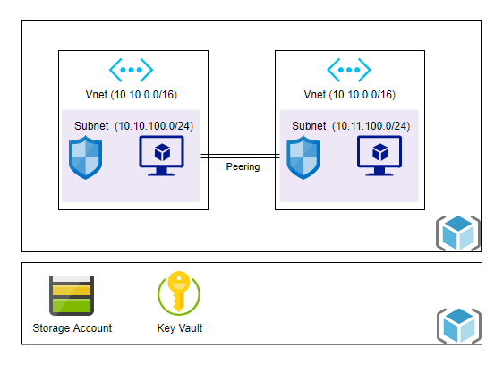

# **Virtual Machine**
This repository contains the main code which calls to the modules Network and Virtual Machine.

[https://github.com/LuisUrresti/TerraformLive]
[https://github.com/LuisUrresti/TerraformModules]

## Overview

### Description
The virtual machines allow the deployment of a number of applications and programs on a virtualized system.
This code build two interconnected virtual machines. Both machines have a Ubunto OS and have been deployed on the subnet belonging to a different virtual network.

### Target Audience
|Audience                   | Purpose                               |
|   --                      |               --                      |
|My projects leaders and me | Concepts review                       |
|My projects leaders and me | Understand how the vm and vnets works |

## Configuration

|Parameter          |TF Name         |Default Value  |Type  |Mandatory|Others                                   |
|   --              |  --            |     --   |    --     |   --    |         --                              |
|Resource Group     |rsg_name        |  N/A     |String     |   yes   | Name of the resource group              |
|Azure Region       |location        |  N/A     | String    |   yes   | Specifies the supported Azure location  |
|Tag Enviroment     |enviroment      |  N/A     | String    |   yes   | Tag to group all resources              |
|Interface 1        |interface_name_1|  N/A     | String    |   yes   | Name of the interface vm_1tosubnet_1    |
|Interface 2        |interface_name_2|  N/A     | String    |   yes   | Name of the interface vm_1tosubnet_1    |
|Subnet 1 ID        |subnet_id_1     |  N/A     | String    |   yes   | ID of the subnet 1                      |
|Subnet 2 ID        |subnet_id_2     |  N/A     | String    |   yes   | ID of the subnet 2                      |
|Virtual Machine 1  |vm_name_1       |  N/A     | String    |   yes   | Name of virtual machine 1               |
|Virtual Machine 2  |vm_name_2       |  N/A     | String    |   yes   | Name of virtual machine 2               |
|SSH Public Key     |ssh_public_key_file| N/A   | String    |   yes   | Name of the file of the public key      |

### Outputs

|Output Name | Output value                                            | Description |                               
|   --       |                  --                                     | -- |                                        
|rsg         | data.terraform_remote_state.network.outputs.rsg         |Name of the resource group to the other modules|
|subnet_id_1 | data.terraform_remote_state.network.outputs.subnet_id_1 |ID of the subnet 1|
|subnet_id_2 | data.terraform_remote_state.network.outputs.subnet_id_2 |ID of the subnet 2|

### Usage

| Variable  | Value |
|   --      |  --   |
|rsg_name   | data.terraform_remote_state.network.outputs.rsg |
|location   | northeurope|
|enviroment | Repaso_1   |
|interface_name_1 | interface1 |
|interface_name_2 | interface2 |
|ipconfig_name    | ipconfig   |
|subnet_id_1      | data.terraform_remote_state.network.outputs.subnet_id_1 |
|subnet_id_2      | data.terraform_remote_state.network.outputs.subnet_id_2 |
|vm_name_1        | vm1   |
|vm_name_2        | vm2   |
|ssh_public_key_file | ../Resources/key.pub |

### Dependencies

The following resources must exist before the deployment can take place.

    - Azure Subscription
    - Storage account resource group ("rsg_storage_account" you could change this name)
    - Storage account  ("stacc7109" you could change this name)
    - Container ("terraform" you could change this name)

## Architecture

## Networking

To deploy the virtual machines, two virtual networks must first be deployed. Each of these virtual networks has a virutal subnetwork that will host the virtual machine. As said before, the virtual machines have Ubuntu 18.04-LTS and to access them you have to use a SSH protocol. For that reason, there is a network security group in each subnet which has a rule to allow just the ssh trafic through the port 22.

